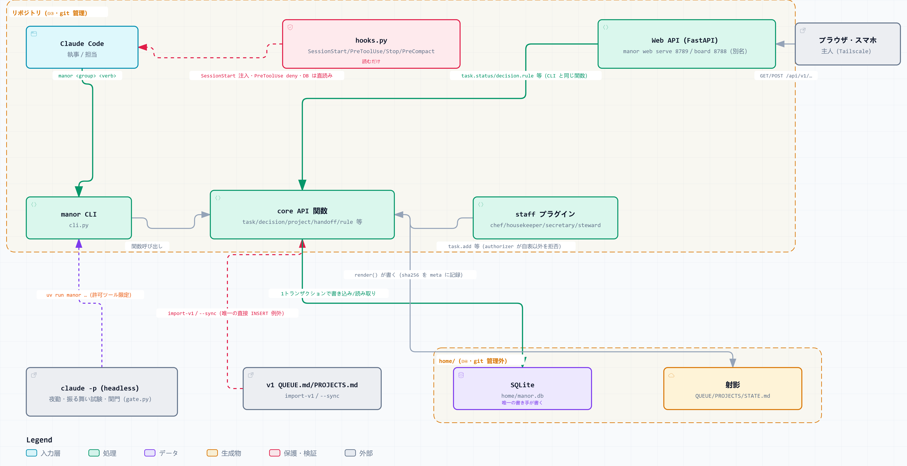

*English README → [README.en.md](README.en.md)*

# AI Manor

**家のことを任せられる AI 執事と、その部下たち。** [Claude Code](https://claude.com/claude-code) の上で動く、
自分の PC の中だけで完結する個人用のアシスタントです。

執事に話しかけると、タスクを預かり、段取りを決め、必要なら部下に振ります。部下は台所・家事・家計・予定を
それぞれ担当し、献立を考え、買い物リストを作り、消耗品の残量を見て、支出を記録し、今日の予定を並べます。
やり取りはすべて手元のデータベースに残り、Web アプリからも見られます。**外部のサービスへは何も送りません。**

## たとえば、こんなことを頼めます

| 言うこと | 起きること |
|---|---|
| 「牛乳と卵を買っておいて」 | 買い物リストに入り、次に台所を開いたときに出る |
| 「冷蔵庫にあるもので夕飯を考えて」 | 在庫と好み・アレルギーを見て献立を出す。作ったら記録に残る |
| 「来週の水曜に歯医者」 | 予定に入り、当日の朝の一覧と小窓の知らせに出る |
| 「今月いくら使った？」 | 費目ごとの内訳と、予算との差を出す |
| 「この件、どうなってる？」 | そのタスクに繋がる判断・メモ・関連タスクだけを集めて答える |
| 「洗剤が切れそう」 | 消耗品の残量を下げ、切れる前に買い物リストへ回す |

判断に迷うこと（外部への送信・公開・削除・課金）は**勝手に実行せず、承認待ちとして積まれます**。
朝いちばんに画面を開けば、待っているものが並んでいます。

## クイックスタート

**前提**: [uv](https://docs.astral.sh/uv/)・[Claude Code](https://claude.com/claude-code)・Node.js。
Windows と macOS で動作確認しています（OS 固有スクリプトを持たない設計なので Linux でも動くはずです）。

```bash
uv sync                        # 依存を入れる
uv run manor init --demo       # DB と、試せる合成データ（架空の家庭。実在の人名は入りません）
uv run manor web build         # 画面を組む（初回のみ）
uv run manor web serve --open  # http://127.0.0.1:8789/
```

`--demo` を付けると、**架空の家庭のデータが入った状態**ですべての画面を触れます。捨てて作り直すのも自由です。

続けて、このフォルダを **Claude Code** で開いてください。開いた時点で執事として振る舞います
（初回の「このワークスペースを信頼するか」は受け入れてください。受け入れないと許可リストと hooks が効きません）。

自分の家庭で使うときは `--demo` を外します。空の状態で画面を開くと**初回セットアップ**に入り、
呼び名・使いたい機能・最初のプロジェクトとタスクを順に聞かれます（どの段も「あとで」で飛ばせます）。

## 画面



執事と部下、手元のデータベース、Web アプリの関係。`docs/diagrams/*.html` を開くと、検索・フォーカス・
テーマ切替のできる対話版になります（一覧は [`docs/diagrams/`](docs/diagrams/)）。

## 誰が何を預かるか

| 誰 | 頼めること（例） | CLI グループ |
|---|---|---|
| 執事 butler | タスク・プロジェクトの管理、判断待ちの裁定、部下への委譲、整合検査、文脈の組み立て | `manor task` `project` `decision` `handoff` `check` `ctx` |
| 料理長 chef | 在庫、献立の提案・記録、買い物リスト、好み・アレルギー | `manor chef` |
| 家政婦 housekeeper | 家事当番、消耗品の残量、設備の手入れ周期、ゴミの日 | `manor house` |
| 家令 steward | 支出・収入、定期支払いの期日、予算との差、月別の傾向 | `manor money` |
| 秘書 secretary | 予定・控え、日次一覧、inbox の仕分け、相対日付の解決 | `manor sec` |
| 検分 qa | 作ったものを検める。直さない | `manor talk qa` |
| 監査 auditor | 執事自身の規則を月1で外から検める | `manor talk auditor` |

**「なんでも屋」は作りません。** 担当を立てるのは、繰り返し出てきて、それ自体で完結する領域だけです。
各担当は自分の表にしか書けません。何を頼めるかは [`docs/staff/`](docs/staff/) にあります。

## そのほかの機能

| 機能 | 何をするか | 詳しく |
|---|---|---|
| **家庭用 Web アプリ** `manor web` | ダッシュボード・担当一覧・タスク・部下4名・ルール・取り込み・夜勤の各画面 | [`docs/web.md`](docs/web.md) |
| **姿の小窓** `manor face [--agent <name>]` | 画面の隅に VRM の姿を出す。話しかけて頼み事もできる。担当ごとに姿と声を持てる（**既定のアバターを同梱**） | [`docs/face.md`](docs/face.md) |
| **声かけ** `manor notify` | 判断待ちが**増えたときだけ**、深夜を避けて一度だけ音声で知らせる | [`docs/notify.md`](docs/notify.md) |
| **声の機構** `manor voice` | VOICEVOX で喋らせる（任意。無くても OS 既定の声で動く） | [`docs/voice.md`](docs/voice.md) |
| **担当との直接対話** `manor talk <name>` | 執事を介さず料理長に献立を聞く等 | [`docs/talk.md`](docs/talk.md) |
| **スマホから** Tailscale | `tailscale serve --bg 8789` と passcode。公開 URL は作りません | [`docs/tailscale.md`](docs/tailscale.md) |
| **カレンダーの取り込み** `manor calendar` | ICS を読み、予定に取り込む（読むだけ。書き戻しません） | [ADR-012](docs/design/ADR-012_calendar_and_i18n.md) |
| **夜勤** `manor night` | 就寝中に指示書へ書いた作業だけを自走させる（OS への登録は既定オフ） | [`docs/night.md`](docs/night.md) |
| **起動ショートカット** `manor shortcut create` | デスクトップに作る。開くと既存サーバを止め→ビルド→起動→ブラウザを開く | [`docs/shortcut.md`](docs/shortcut.md) |
| **家庭のルール** `manor rule` | 門限・来客対応などを scope と tag つきで置く | [`docs/rules.md`](docs/rules.md) |
| **日本語 / 英語** | 画面もコマンドも切り替えられます（「設定 → 言語」） | [ADR-012](docs/design/ADR-012_calendar_and_i18n.md) |

## 使い方

| やりたいこと | コマンド |
|---|---|
| 執事と話す | このフォルダで `claude` |
| 担当と直接話す | `uv run manor talk chef` / `housekeeper` / `steward` / `secretary` |
| 画面を見る | `uv run manor web serve --open` |
| 判断待ちを裁定する | 画面の「要対応」、または `uv run manor decision rule <id> approved --ruling ".."` |
| タスクを起票する | 画面から、または `uv run manor task add "<title>"` |
| 整合検査 | `uv run manor check` |

全コマンドが `manor <group> <verb> [...] [--json]` の形です。正確な引数は `manor <group> --help` で。

## 手元のデータの扱い

- **外部へ送りません。** 手元の SQLite を読み書きするだけです（Slack・Notion 等の連携は任意の拡張機能で、
  入れなければ何も送りません）。外へ出す操作は必ず承認待ちになります
- **あなたのデータは git に入りません。** `home/`（DB・呼び名・タスク・予定・家計）は既定で追跡外です
- **コミット前に漏れを止めます。** `~/.manor/git-leak-terms.txt`（人名・案件名など。**リポジトリの外**に
  置きます）に載せた語が混ざっていると、pre-commit がコミットを止めます

はじめて git 管理下に置くときは hooks を有効にしてください。

```bash
git config core.hooksPath .githooks
```

## 文書の地図

| 読みたいもの | どこ |
|---|---|
| 各担当に何を頼めるか | [`docs/staff/`](docs/staff/) |
| 設計判断そのもの（ADR） | [`docs/design/`](docs/design/) |
| 全体の索引 | [`docs/README.md`](docs/README.md) |
| 開発の現在地と次の方針 | [`ROADMAP.md`](ROADMAP.md) |
| 機能の変更履歴 | [`CHANGELOG.md`](CHANGELOG.md) |

## ライセンス

**MIT License**（[`LICENSE`](LICENSE)）。

**ただし同梱アバター `assets/face/default.vrm` は対象外です。**
[VRoid Studio](https://vroid.com/studio) でピクシブ株式会社の公式サンプルモデル
**AvatarSample** をもとに作成したもので、[サンプルモデルの利用条件](https://vroid.pixiv.help/hc/ja/articles/4402394424089-AvatarSample-A-Z)に従います
——無償での再配布・改変・商用利用は認められていますが、**有償での再配布は禁じられています**。
詳しくは [`assets/face/NOTICE.md`](assets/face/NOTICE.md) を参照してください。

小窓に自分の姿を出したいときは、同梱ファイルを置き換える必要はありません。
Web アプリの「設定 → 姿（小窓）」からアップロードすれば、そちらが優先されます。
